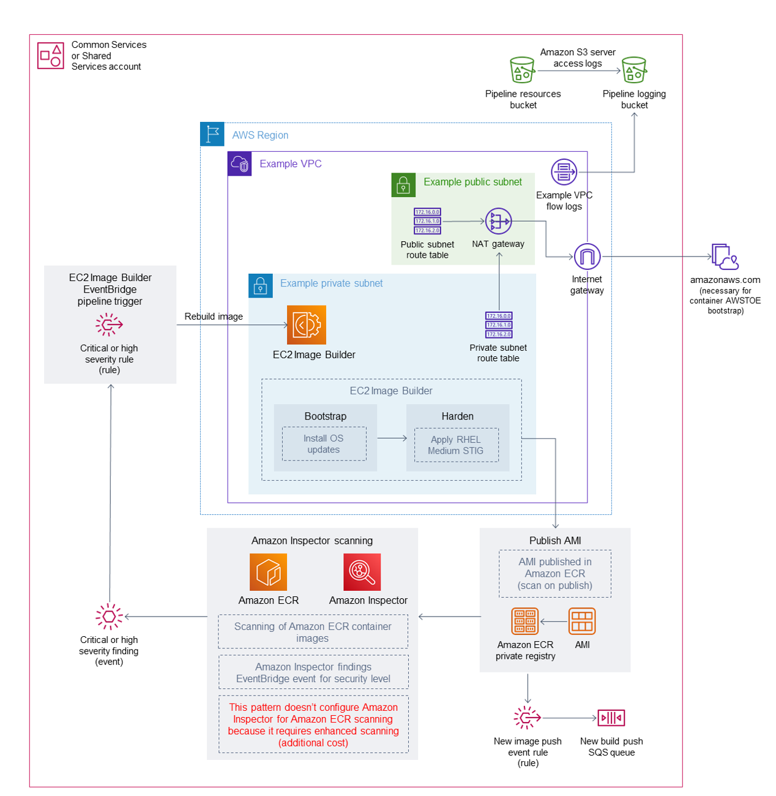

# Terraform EC2 Image Builder Container Hardening Pipeline summary

Creates and manages EC2 Image Builder Container resources. Specifically this pipeline builds an Amazon Linux 2 Baseline Container using Docker with RHEL 7 STIG Version 3 Release 7 hardening applied, along with a few other configurations. See recipes.tf for more details.

Test.

## Prerequisites

* Terraform v.15+. Download and setup Terraform. Refer to the official Terraform instructions to get started.
* AWS CLI installed for setting your AWS Credentials for Local Deployment.
* An AWS Account to deploy the infrastructure within.
* Git (if provisioning from a local machine).
* A role within the AWS account that you are able create AWS resources with
* Ensure the .tfvars file has all variables defined or define all variables at “Terraform Apply” time

## Target technology stack  

* S3 Bucket for the Pipeline Component Files
* ECR
* 1 VPC, 1 Public and 1 Private subnet, Route tables, a NAT Gateway, and an Internet Gateway
* An EC2 Image Builder Pipeline, Recipe, and Components
* 1 Container Image
* 1 KMS Key for Image Encryption
* A Cloudwatch Event Rule which triggers the start of the pipeline based on an Inspector2 Finding of “High”
* This pattern creates 29 AWS Resources total.

## Limitations 

VPC Endpoints cannot be used, and therefore this solution creates VPC Infrastructure that includes a NAT Gateway and an Internet Gateway for internet connectivity from its private subnet. This is due to the bootstrap process by AWSTOE, which installs AWS CLI v2 from the internet.

## Operating systems

This Pipeline only contains a recipe for Amazon Linux 2.

1. Amazon Linux 2

## Structure

``` console
├── pipeline.tf
├── image.tf
├── infr-config.tf
├── dist-config.tf
├── components.tf
├── recipes.tf
├── LICENSE
├── README.md
├── hardening-pipeline.tfvars
├── config.tf
├── files
│   └── assumption-policy.json
├── roles.tf
├── kms-key.tf
├── main.tf
├── outputs.tf
├── sec-groups.tf
└── variables.tf
```

## Module details

1. hardening-pipeline.tfvars contains the Terraform variables to be used at apply time
2. pipeline.tf creates and manages an EC2 Image Builder pipeline in Terraform
3. image.tf contains the definitions for the Base Image OS, this is where you can modify for a different base image pipeline.
4. infr-config.tf and dist-config.tf  contain the resources for the minimum AWS infrastructure needed to spin up and distribute the image.
5. components.tf contains an S3 upload resource to upload the contents of the /files directory, and where you can modularly add custom component YAML files as well.
6. recipes.tf is where you can specific different mixtures of components to create a different container recipe.
7. trigger-build.tf is an inspector2 finding based pipeline trigger.
8. roles.tf contains the IAM policy definitions for the EC2 Instance Profile and Pipeline Deployment Role
9. infra-network-config.tf contains the minimum VPC infrastructure to deploy the container image into
10. /files contains the .yml files which are used to define the components used in components.tf

## Target architecture


## Automation and scale

* This terraform module set is intended to be used at scale. Instead of deploying it locally, the Terraform modules can be used in a multi-account strategy environment, such as in an AWS Control Tower with Account Factory for Terraform environment. In that case, a backend state S3 bucket should be used for managing Terraform state files, instead of managing the configuration state locally.

* To deploy for scaled use, deploy the solution to one central account, such as “Shared Services/Common Services” from a Control Tower or Landing Zone account model and grant consumer accounts permission to access to the ECR Repo/KMS Key, see this blog post explaining the setup. For example, in an Account Vending Machine or Account Factory for Terraform, add permissions to each account baseline or account customization baseline to have access to that ECR Repo and Encryption key.

* This container image pipeline can be simply modified once deployed, using EC2 Image Builder features, such as the “Component” feature, which will allow easy packaging of more components into the Docker build.

* The KMS Key used to encrypt the container image should be shared across accounts which the container image is intended to be used in

* Support for other images can be added by simply duplicating this entire Terraform module, and modifying the recipes.tf attributes, parent_image = "amazonlinux:latest" to be another parent image type, and modifying the repository_name to point to an existing ECR repository. This will create another pipeline which deploys a different parent image type, but to your existing ECR repostiory.

## Deployment steps

### Local Deployment

1. Setup your AWS temporary credentials.

See if the AWS CLI is installed:
``` shell
   $ aws --version
   aws-cli/1.16.249 Python/3.6.8...
```

AWS CLI version 1.1 or higher is fine

If you instead got command not found then install the AWS CLI

2. Run aws configure and provide the following values:
``` shell
 $ aws configure
 AWS Access Key ID [*************xxxx]: <Your AWS Access Key ID>
 AWS Secret Access Key [**************xxxx]: <Your AWS Secret Access Key>
 Default region name: [us-east-1]: <Your desired region for deployment>
 Default output format [None]: <Your desired Output format>
```
3. Clone the repository
``` shell
git clone https://gitlab.aws.dev/msaintcr/terraform-ec2-image-builder-container-hardening-pipeline.git
```
4. Navigate to the directory containing this solution before running the commands below:
``` shell
cd terraform-ec2-image-builder-container-hardening-pipeline
```

5. Update variables in hardening-pipeline.tfvars to match your environment and your desired configuration. You cannot use provided variable values, the solution will not deploy.
``` json
account_id     = "012345678900"
aws_region     = "us-east-1"
vpc_name       = "example-hardening-pipeline-vpc"
kms_key_alias = "image-builder-container-key"
ec2_iam_role_name = "example-hardening-instance-role"
hardening_pipeline_role_name = "example-hardening-pipeline-role"
aws_s3_ami_resources_bucket = "example-hardening-ami-resources-bucket-0123"
image_name = "example-hardening-al2-container-image"
ecr_name = "example-hardening-container-repo"
recipe_version = "1.0.0" 
ebs_root_vol_size = 10
```

6. The following command initializes, validates and applies the terraform modules to the environment using the variables defined in your .tfvars file:
``` shell
terraform init && terraform validate && terraform apply -var-file *.tfvars -auto-approve
```

7. After successfully completion of your first Terraform apply, if provisioning locally, you should see this snippet in your local machine’s terminal:
``` shell
Apply complete! Resources: 29 added, 0 changed, 0 destroyed.
```

## Troubleshooting

*When running Terraform apply or destroy commands from your local machine, you may encounter an error similar to the following:*

``` json
Error: configuring Terraform AWS Provider: error validating provider credentials: error calling sts:GetCallerIdentity: operation error STS: GetCallerIdentity, https response error StatusCode: 403, RequestID: 123456a9-fbc1-40ed-b8d8-513d0133ba7f, api error InvalidClientTokenId: The security token included in the request is invalid.
```

This error is due to the expiration of the security token for the credentials used in your local machine’s configuration.

See “Set and View Configuration Settings” from the AWS Command Line Interface Documentation to resolve.

## Author

* Mike Saintcross [msaintcr@](msaintcr@amazon.com)